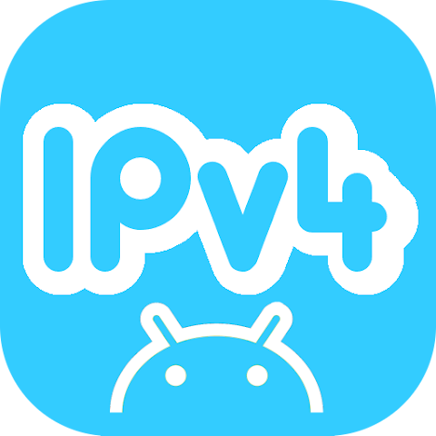
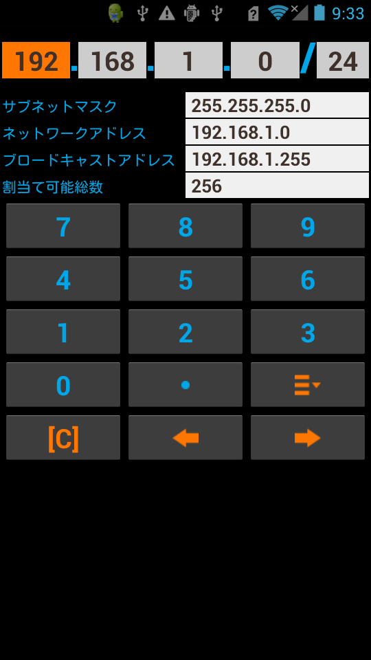
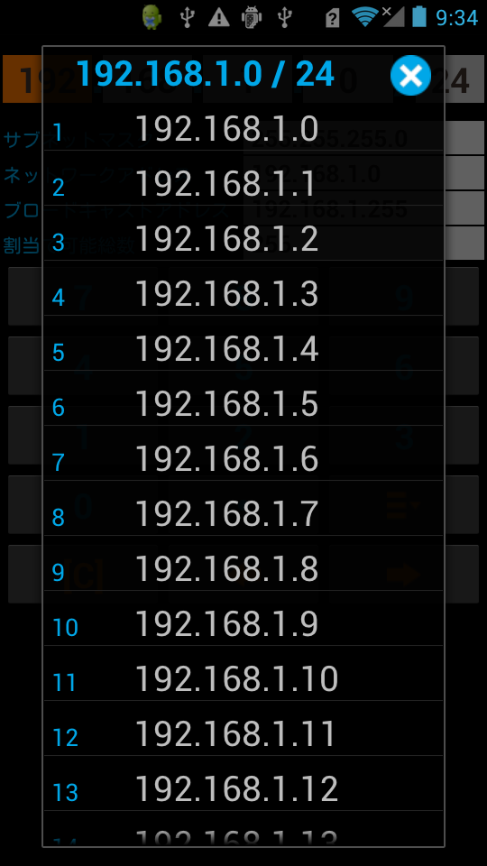

# Quick IP Calc

<p>

</p>

Quickly This is an application for calculating the IP address

<p>
<a href="https://play.google.com/store/apps/details?id=com.jojoagogogo.ipcalc">

</a>

<a href="https://github.com/jojoagogogo/ipcalc/releases/latest/download/ipcalc.apk">

</a>

</p>

<p>


</p>

## Quick IP Calc

```
Quickly This is an application for calculating the IP address

Please enter the IP address and Subnet Mask
calculated the following:
* Network address
* Broadcast address
* Assignable IP

Results are displayed Quickly Each time you enter

You can view a list of IP Address that you specify

support only IPv4 currently
```

## IP アドレスをすばやく計算

```
IPアドレスをすばやく計算するアプリです

IPアドレスとサブネットマスク(CIDR)を入力してください
* ネットワークアドレス
* ブロードキャストアドレス
* 割当て可能IP
　を算出します

結果が入力毎に表示されます

指定したIPアドレスのリストが表示できます

現在IPv4のみ対応しています
```
